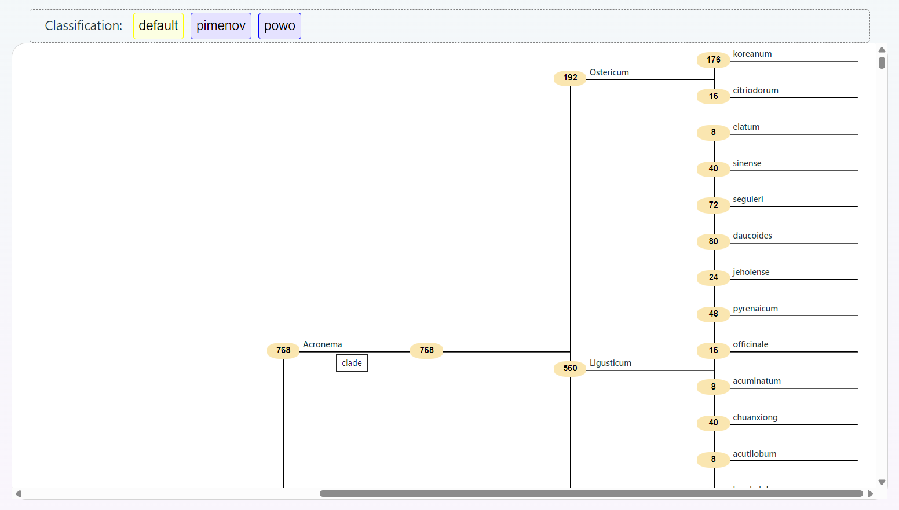
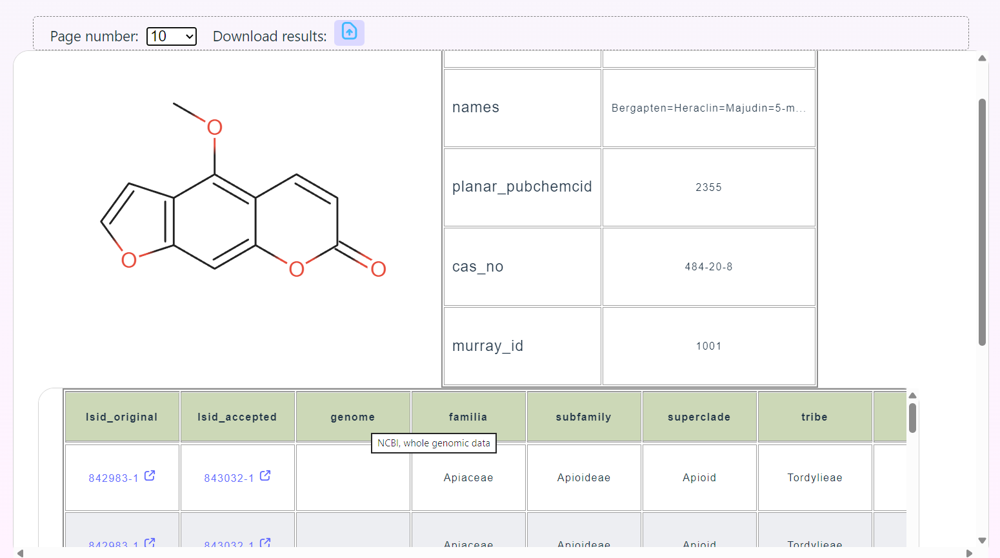
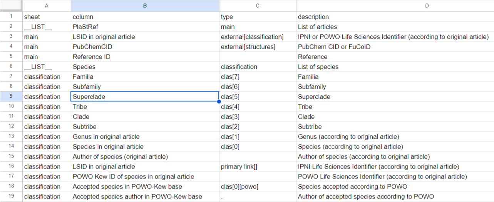

# Furanocoumarins Analysis Platform

A web‑based platform for analyzing the content of furanocoumarins and other substances in plants.
It allows you to download data from Google Tables, build phylogenetic trees and analyze the distribution of substances by taxanomy.

Below is an example of the site's UI (home page): search bar, phylogenetic tree, and results table.




Which data will be displayed on the website is completely determined by the administrator through the settings in the Google Sheet, as shown below. Using the __LIST__ type, a list of sheets that contain data of the same type is registered, and all columns that will be displayed on the website are specified for them



## Key features

- **Importing data**: downloading data from Google Tables.
- **Data analysis**: filtering by conditions with visualization of results.
- **Phylogenetic trees**: automatic construction of a tree indicating the number of finds for each taxonomic group.
- **The results are in the table**: final table with filtered data.
- **Admin panel**: database content management (adding, editing, deleting records).

## Technology stack

**Backend**:
- Language: Go.
- Containerization: Docker.
- Database of administrators: PostgreSQL + Redis.
- Table data storage: Apache Cassandra.
- UI library for Cassandra: Netflix Data Explorer.
- Authorization: JWT.

**The frontend**:
- React + Vite + TypeScript.

## Project Launch

### 1. Preparing the backend

1. Open docker-compose.template.yaml and set the values of the environment variables (hints are provided in the file).

2. Launch the services:
   ```bash
   docker compose -f docker-compose.template.yaml up
   ```

### 2. Database initialization
After the first launch of the backend, run the CLI commands for:

- build cli binary:
  ```bash
  go build cli/main.go -o cli
  ```

- database initialization:
  ```bash
  ./cli init postgresql
  ./cli init cass_key
  ./cli init cassandra
  ```

- creating administrator accounts:
  ```bash
  ./cli create_admin <username> <email>
  ```

### 3. Launching the frontend
1. Build a Docker image:
   ```bash
   docker build -t furanocoumarins-frontend .
   ```

2. Run container
   ```bash
   docker run furanocoumarins-frontend
   ```

## Environment variables
The main environment variables are specified in docker-compose.template.yaml. To work, you will need:

- Connection settings for PostgreSQL, Redis, Cassandra.

- STMP and JWT‑secrets.

- CORS and other variables.

## Admin Panel
It is accessible via a secure route (authorization via JWT is required). Allows:

- Manage records in the database.

- Import/export data.

## License
[TO DO: MIT]
