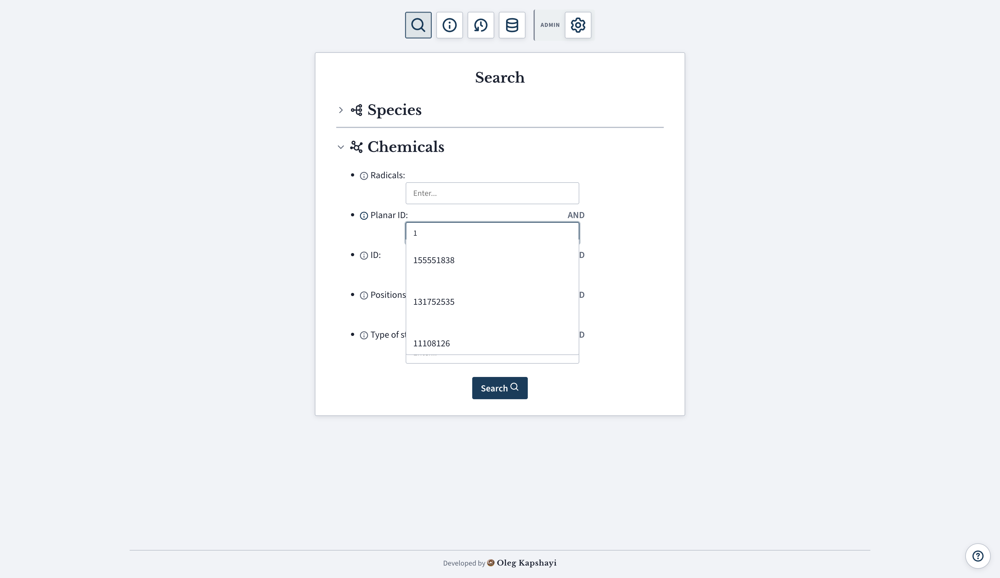
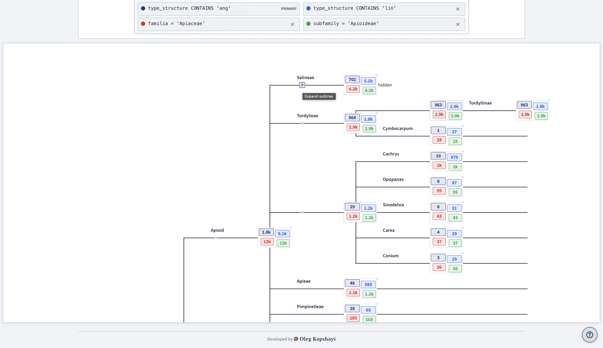
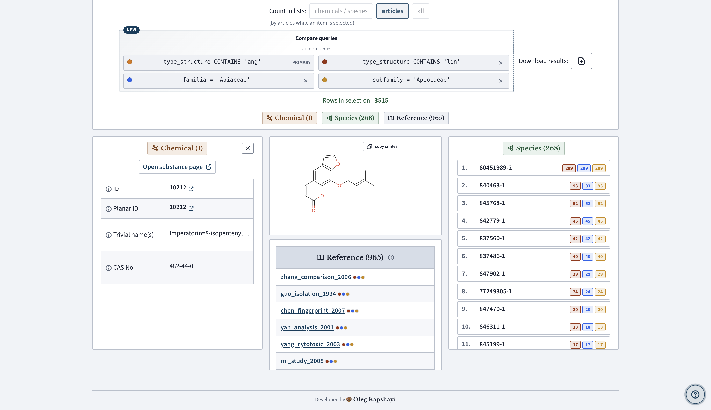
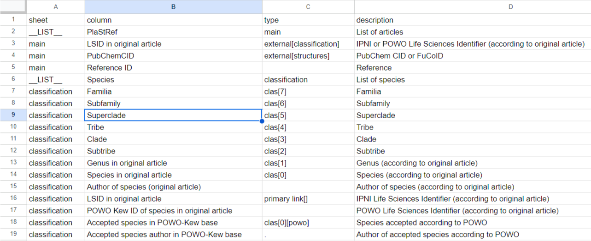
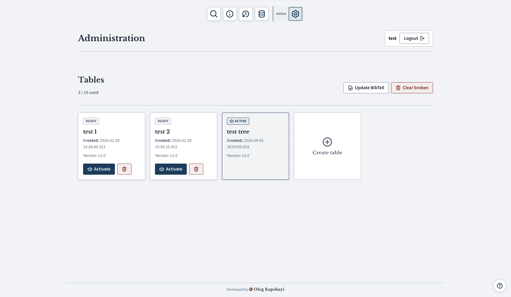

# Furanocoumarins Analysis Platform



A web‑based platform for analyzing the content of furanocoumarins and other substances in plants.
It allows you to download data from Google Tables, build phylogenetic trees and analyze the distribution of substances by taxanomy.

Below is an example of the site's UI (home page): search bar, phylogenetic tree, and results table.




Which data will be displayed on the website is completely determined by the administrator through the settings in the Google Sheet, as shown below. Using the __LIST__ type, a list of sheets that contain data of the same type is registered, and all columns that will be displayed on the website are specified for them




## Key features

- **Importing data**: downloading data from Google Tables.
- **Data analysis**: filtering by conditions with visualization of results.
- **Phylogenetic trees**: automatic construction of a tree indicating the number of finds for each taxonomic group.
- **The results are in the table**: final table with filtered data.
- **Admin panel**: database content management (adding, editing, deleting records).

## Technology stack

**Backend**:
- Language: Go.
- Containerization: Docker.
- Database of administrators: PostgreSQL + Redis.
- Table data storage: Apache Cassandra.
- Object storage: S3-compatible storage (MinIO in dev) for editable page content (About, substance descriptions).
- UI library for Cassandra: Netflix Data Explorer.
- Authorization: JWT.

**The frontend**:
- React + Vite + TypeScript.

## Project launch

### Local development

For local work use [docker-compose.local.yaml](docker-compose.local.yaml): go-auth, PostgreSQL, Redis, Cassandra, and **MinIO** (S3-compatible storage for editable pages). Monitoring services are disabled in this compose file by default.

1. Generate env files and `monitoring/grafana.ini`:

   ```bash
   ./cli init_env
   ```

   Edit `env/.env` if needed. See [Environment variables](#environment-variables).

2. Start the stack:

   ```bash
   docker compose -f docker-compose.local.yaml up -d
   ```

3. Initialize databases and create an admin — see [Database initialization](#database-initialization).

4. Frontend (optional):

   ```bash
   docker build -t furanocoumarins-frontend ./frontend
   docker run -p 5173:80 furanocoumarins-frontend
   ```

Backend API is available at `http://localhost:8081`. MinIO console — `http://localhost:9001`.

### Production

Production runs on a cloud VM via **Docker Swarm** ([deploy/swarm/](deploy/swarm/)): healthchecks, secrets, nginx with TLS, Prometheus/Grafana/Loki.

```bash
docker swarm init
./cli init_env
# edit env/.env: cloud S3, DOMAIN_PREF, production secrets
chmod +x deploy/swarm/scripts/*.sh
./deploy/swarm/scripts/init-secrets.sh
./deploy/swarm/scripts/deploy.sh
```

Configure `env/.env` for cloud S3 (not MinIO). TLS certificates are managed by Certbot on the host and mounted into the nginx container.

Full setup, certificate renewal, and secrets rotation: [deploy/swarm/README.md](deploy/swarm/README.md).

## Database initialization

After the first launch of the backend, build the CLI and run init in this order (keyspace first, then tables):

- Build CLI binary:
  ```bash
  go build cli/main.go -o cli
  ```

- Database initialization (order matters: create keyspace, then tables):
  ```bash
  ./cli init postgresql
  ./cli init cass_key    # Cassandra keyspace chemdb
  ./cli init cassandra   # Tables including chemdb.pages (for About and substance pages)
  ```

- Creating administrator accounts:
  ```bash
  ./cli create_admin <username> <email>
  ```

- Run tests:
  ```bash
  cd backend/admin && go test -v ./...
  ```
  or inside container
  ```bash
  docker build backend/admin --file Dockerfile.test --build-arg VAR=$(date +%s)
  ```

- Cassandra vs Redis vs PostgreSQL cache benchmarks (Podman + `go test -bench`, not part of default `./...`): [backend/admin/benchmarks/cassandra_vs_redis/README.md](backend/admin/benchmarks/cassandra_vs_redis/README.md).
- Cassandra sparse-read grid benchmark (large tables, Cassandra only): [backend/admin/benchmarks/cassandra_sample_grid/README.md](backend/admin/benchmarks/cassandra_sample_grid/README.md).

## S3 / MinIO (object storage)

Editable page content (About page, substance descriptions by SMILES at `/page/:smiles`) is stored in S3-compatible object storage. The backend serves content from S3 and writes to it when an admin saves changes.

- **Local/dev:** MinIO via `docker-compose.local.yaml` (service `minio`). The bucket is created automatically on first save.
- **Production:** cloud S3 — set `S3_ENDPOINT`, credentials, and bucket in `env/.env` before deploy.

Without S3 (or with empty `S3_ENDPOINT`), editable pages will not work.

Backend environment variables for go-auth (see `backend/admin/settings/settings.go`):

- `S3_ENDPOINT` — e.g. `http://minio:9000`
- `S3_ACCESS_KEY_ID`, `S3_SECRET_ACCESS_KEY`
- `S3_BUCKET` — e.g. `pages`
- `S3_REGION`, `S3_USE_PATH_STYLE` (optional)

## Monitoring

Configs live in [monitoring/](monitoring/):

- **Prometheus** — app, nginx, PostgreSQL, Redis, Cassandra, VM metrics; [monitoring/prometheus.yml](monitoring/prometheus.yml)
- **Grafana** — dashboards under [monitoring/dashboards/](monitoring/dashboards/) (Infrastructure overview, Nginx)
- **Loki** + **Promtail** — container logs (DB services labeled) and VM syslog

In **production**, monitoring is part of the Swarm stack (Grafana behind nginx at the sslip.io domain). In **local dev**, monitoring services are commented out in `docker-compose.local.yaml`; uncomment them to run Prometheus/Grafana locally at `http://localhost:3000`.

## Environment variables

Main backend (go-auth) variables are loaded from `env/.env` (and related files under `env/`). You need:

**Backend (go-auth):**
- PostgreSQL: `PG_USER`, `PG_PASSWORD`, `PG_DB`
- Redis: `REDIS_ADDR`, `REDIS_PASSWORD`
- Cassandra: `CASSANDRA_HOST`
- JWT: `SECRET_KEY`
- CORS: `ALLOW_ORIGIN`
- Links in emails: `DOMAIN_PREF`
- S3 (for editable pages): `S3_ENDPOINT`, `S3_ACCESS_KEY_ID`, `S3_SECRET_ACCESS_KEY`, `S3_BUCKET`; optionally `S3_REGION`, `S3_USE_PATH_STYLE`
- SMTP and other app settings as used in the compose/env files

**Frontend:**
- `VITE_REACT_APP_BACKEND_SOURCE` — backend API base URL (used as `BASE_URL` in [frontend/src/config.tsx](frontend/src/config.tsx)). Must be set at build/run time for the frontend to call the API.

## Updating API documentation (Swagger)

The admin backend exposes Swagger UI at `/docs` (no auth required). To regenerate the OpenAPI spec after changing routes or annotations:

1. Install the [swag](https://github.com/swaggo/swag) CLI (once):
   ```bash
   go install github.com/swaggo/swag/cmd/swag@latest
   ```

2. From the admin backend directory, generate docs and apply the patch so examples show correct field names (`error`, `token`, `val`) instead of generic placeholders:
   ```bash
   cd backend/admin
   swag init -g main.go --parseDependency --parseInternal
   go run ./scripts/patch_swagger.go
   ```

3. Restart the backend (or run it) and open `http://<host>/docs` to view the updated documentation.

## Admin Panel

Accessible via a secure route (JWT required). It allows:

- Managing records in the database.
- Import/export of data.
- Editing page content stored in S3: the About page and substance descriptions (by SMILES).

## License
[TO DO: MIT]
