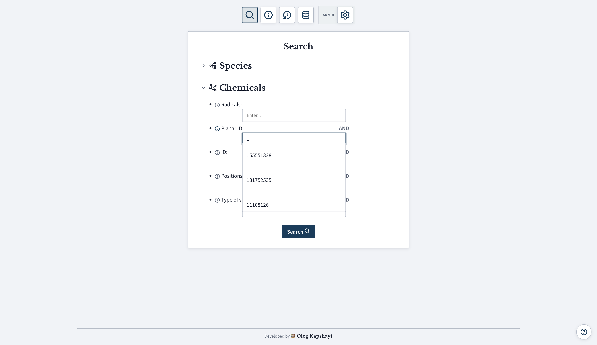
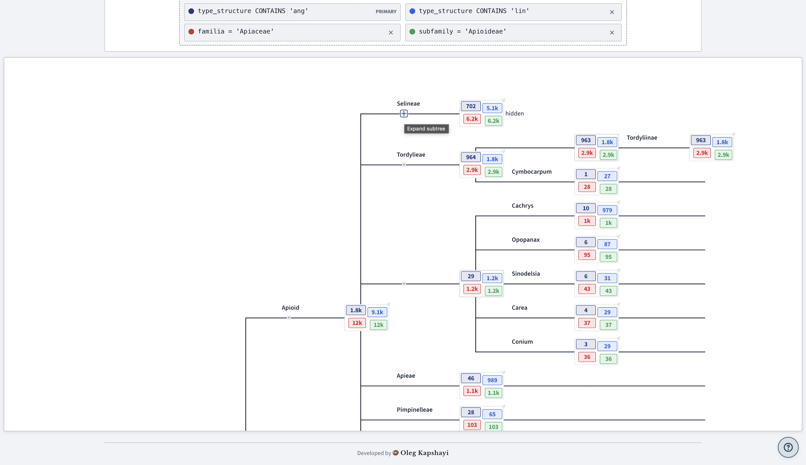
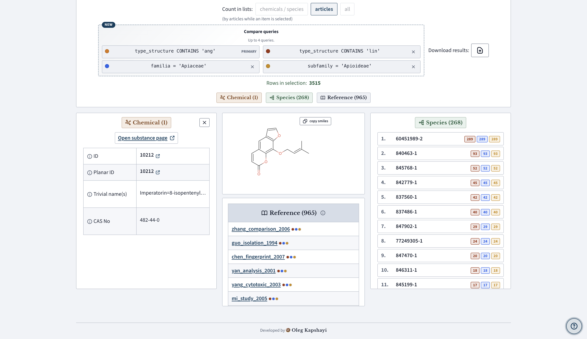
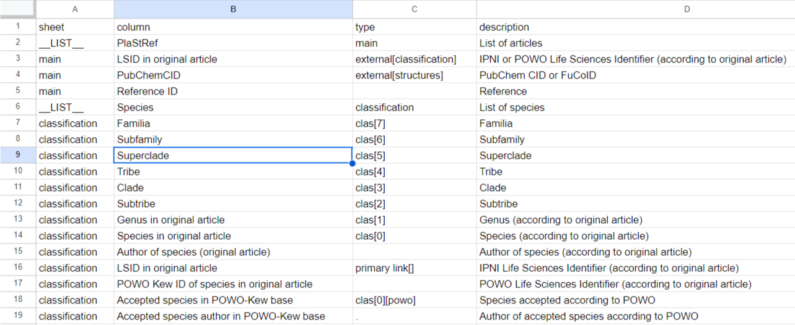
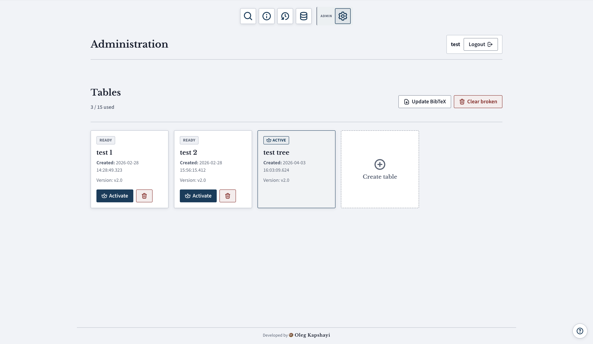

# Furanocoumarins Analysis Platform

Authentication, authorization, and the one-time user migration are documented in [docs/AUTH_MASTER.md](docs/AUTH_MASTER.md).



A web‑based platform for analyzing the content of furanocoumarins and other substances in plants.
It allows administrators to import XLSX workbooks, build phylogenetic trees and analyze the distribution of substances by taxonomy.

Below is an example of the site's UI (home page): search bar, phylogenetic tree, and results table.




Which data is displayed is determined by metadata inside the uploaded XLSX workbook, as shown below. Using the `__LIST__` type, administrators register workbook sheets that contain the same kind of data and specify the displayed columns.




## Key features

- **Importing data**: uploading validated XLSX workbooks.
- **Data analysis**: filtering by conditions with visualization of results.
- **Query comparison**: run up to four search queries side by side (see [Comparing queries](#comparing-queries)).
- **Phylogenetic trees**: automatic construction of a tree indicating the number of finds for each taxonomic group.
- **The results are in the table**: final table with filtered data.
- **Admin panel**: database content management (adding, editing, deleting records).

## Preserved source entities

Workbook imports retain every registered virtual sheet separately, including
rows not referenced by `main`, alongside the joined table used for search.
`classification` holds species, `structures` holds chemicals, and optional
`publication`/`publications` sheets hold workbook publication records. Other
virtual sheets are preserved too. BibTeX articles remain in the independent
`chemdb.bibtex` table.

These are parsed, unjoined rows: existing defaults, annotation removal, and set
conversion apply, but external keys are not replaced by joined values. Each
dataset's source catalog records physical sheet names, column metadata, natural
keys, provenance, and the stored table pointers. No spreadsheet edits are needed.
Deleting a dataset also deletes its owned source tables; global BibTeX is retained.

The offline Cassandra-to-PostgreSQL importer copies source catalogs and their
tables when present. Older datasets without catalogs retain their existing joined
data, species, and bibliography, but cannot recover original chemical or
publication sheets—including unreferenced records—from those joins. Reimport the
original workbook to obtain complete unjoined sources.

`make test-entity-migration` validates source preservation, cleanup, and real
Cassandra-to-PostgreSQL copying/reruns. Set `TEST_POSTGRES_DSN`,
`TEST_CASSANDRA_HOST`, and optionally `TEST_CASSANDRA_PORT` to **disposable test
databases only**: the tests create and remove scientific-data fixtures in `chemdb`.

## Comparing queries

On the results table and phylogenetic tree pages you can compare several searches at once (up to **4**, including the primary query).

1. Open results for a primary query .
2. In **Compare queries**, add extra query strings.
3. Each query gets a stable color; the set is stored in the URL as `cmp` (JSON array of extras), so you can share or bookmark the comparison.

**Table:** rows are the union of all queries. Colored markers show which queries matched each row; export to `.xlsx` writes one sheet per query plus an About sheet.

**Tree:** count chips on nodes show per-query hit counts (layout adapts for 2–4 series). Colors match the compare bar.

Successful compare groups are also saved in browser **History** (`/history`) for later reopen.

## Technology stack

**Backend**:
- Language: Go.
- Containerization: Docker.
- Identity, OTP, sessions, invitations, bans, and RBAC: private auth-master
  with its own PostgreSQL database.
- The legacy PostgreSQL `users` table is read only by the one-time importer;
  its password hashes are never copied.
- Table data storage: PostgreSQL. Cassandra is only an offline migration source
  for existing deployments and is not part of the runtime stack.
- Object storage: S3-compatible storage (MinIO in dev) for editable page content (About, substance descriptions).
- UI library for Cassandra: Netflix Data Explorer.
- Authorization: JWT.

**The frontend**:
- React + Vite + TypeScript.

## Project launch

### Local development

For local work use [docker-compose.local.yaml](docker-compose.local.yaml): go-auth, PostgreSQL, Redis, and **MinIO** (S3-compatible storage for editable pages). Monitoring services are disabled in this compose file by default.

1. Generate env files and `monitoring/grafana.ini`:

   ```bash
   ./cli init_env
   ```

   Edit `env/.env` if needed. See [Environment variables](#environment-variables).

2. On a first deployment, start infrastructure without `authd`/`go-auth`:

   ```bash
   docker compose -f docker-compose.local.yaml up -d postgres redis minio auth-postgres mailpit
   ```

3. Initialize the domain databases, then run the one-time `make auth-import`
   migration. The target starts `authd` once to initialize its owned schema,
   stops both old and new auth writers for the import, then restores the
   services — see
   [Database initialization](#database-initialization) and
   [auth-master integration](docs/AUTH_MASTER.md).

4. Start the complete stack. On later runs this is the only Compose command
   needed:

   ```bash
   docker compose -f docker-compose.local.yaml up -d
   ```

5. Frontend (optional):

   ```bash
   podman build --pull=always -t furanocoumarins-frontend ./frontend
   podman run -p 5173:8080 furanocoumarins-frontend
   ```

Backend API is available at `http://localhost:8081`. MinIO console — `http://localhost:9001`.

### Production

Production runs on a cloud VM via **Docker Swarm** ([deploy/swarm/](deploy/swarm/)): healthchecks, secrets, nginx with TLS, Prometheus/Grafana/Loki.

```bash
docker swarm init
go build -o cli ./cli
./cli init_env
cp deploy/swarm/production.conf.example deploy/swarm/production.conf
nano deploy/swarm/production.conf
nano env/.env
nano deploy/swarm/configs/nginx.conf
sudo certbot certonly --standalone -d api.furan.example.com -d grafana.furan.example.com
./deploy/swarm/scripts/init-secrets.sh
./deploy/swarm/scripts/deploy.sh
./deploy/swarm/scripts/run-auth-import.sh
docker stack ps furanocoumarins
```

Deploy the React SPA separately at `PUBLIC_APP_ORIGIN`. Replace the API and
Grafana host names in nginx and the Certbot command.
Configure `env/.env` for cloud S3 (not MinIO) and its existing mail secret.
The scripts read the ignored `production.conf`; no deployment variables or
callback files need to be exported. TLS certificates are managed by Certbot on
the host and mounted into the nginx container.

Full setup, certificate renewal, and secrets rotation: [deploy/swarm/README.md](deploy/swarm/README.md).

## Database initialization

Before the first complete backend launch, start PostgreSQL. The backend creates its
own `chemdb` schema on startup. Auth-master owns its own schema and initializes
it when `authd` starts; the legacy PostgreSQL schema is only the migration source.

- Build CLI binary:
  ```bash
  go build -o cli ./cli
  ```

- Existing Cassandra installations are cut over once, while they are quiesced:
  ```bash
  (cd backend/admin && \
    FURANO_CASSANDRA_HOST=legacy-cassandra \
    FURANO_POSTGRES_DSN='postgres://…' \
    go run ./cmd/migrate-cassandra-postgres)
  ```

- Do not create new administrators in the legacy users table. The selected
  migrated superuser creates invitations and is the only actor allowed to
  grant the auth-master `admin` role.

- Install and run the repository-owned auth/migration/browser gates:
  ```bash
  make install
  make test
  ```

- Cassandra vs Redis vs PostgreSQL cache benchmarks (Podman + `go test -bench`, not part of default `./...`): [backend/admin/benchmarks/cassandra_vs_redis/README.md](backend/admin/benchmarks/cassandra_vs_redis/README.md).
- Cassandra sparse-read grid benchmark (large tables, Cassandra only): [backend/admin/benchmarks/cassandra_sample_grid/README.md](backend/admin/benchmarks/cassandra_sample_grid/README.md).

## S3 / MinIO (object storage)

Editable page content (About page, substance descriptions by SMILES at `/page/:smiles`) is stored in S3-compatible object storage. The backend serves content from S3 and writes to it when an admin saves changes.

- **Local/dev:** MinIO via `docker-compose.local.yaml` (service `minio`). The bucket is created automatically on first save.
- **Production:** cloud S3 — set `S3_ENDPOINT`, credentials, and bucket in `env/.env` before deploy.

Without S3 (or with empty `S3_ENDPOINT`), editable pages will not work.

Backend environment variables for go-auth (see `backend/admin/settings/settings.go`):

- `S3_ENDPOINT` — e.g. `http://minio:9000`
- `S3_ACCESS_KEY_ID`, `S3_SECRET_ACCESS_KEY`
- `S3_BUCKET` — e.g. `pages`
- `S3_REGION`, `S3_USE_PATH_STYLE` (optional)

## Monitoring

Configs live in [monitoring/](monitoring/):

- **Prometheus** — app, nginx, PostgreSQL, Redis, Cassandra, VM metrics; [monitoring/prometheus.yml](monitoring/prometheus.yml)
- **Grafana** — dashboards under [monitoring/dashboards/](monitoring/dashboards/) (Infrastructure overview, Nginx)
- **Loki** + **Promtail** — container logs (DB services labeled) and VM syslog

In **production**, monitoring is part of the Swarm stack (Grafana behind nginx at the sslip.io domain). In **local dev**, monitoring services are commented out in `docker-compose.local.yaml`; uncomment them to run Prometheus/Grafana locally at `http://localhost:3000`.

## Environment variables

Main backend (go-auth) variables are loaded from `env/.env` (and related files under `env/`). You need:

**Backend (go-auth):**
- PostgreSQL: `PG_USER`, `PG_PASSWORD`, `PG_DB`, `PG_HOST`, `PG_PORT`, `PG_SSLMODE`
- Redis: `REDIS_ADDR`, `REDIS_PASSWORD`
- JWT: `SECRET_KEY`
- CORS: `ALLOW_ORIGIN`
- Links in emails: `DOMAIN_PREF`
- S3 (for editable pages): `S3_ENDPOINT`, `S3_ACCESS_KEY_ID`, `S3_SECRET_ACCESS_KEY`, `S3_BUCKET`; optionally `S3_REGION`, `S3_USE_PATH_STYLE`
- SMTP and other app settings as used in the compose/env files (`SMTP_HOST`, `SMTP_PORT`, `SMTP_TIMEOUT` with a positive five-second default, `MAIL`, `MAIL_SECRET`)

XLSX imports preflight the metadata and joins before their first PostgreSQL
write. PostgreSQL enforces the registry key and active-table uniqueness; an
uncertain database error stops immediately.

**Frontend:**
- `VITE_REACT_APP_BACKEND_SOURCE` — backend API base URL (used as `BASE_URL` in [frontend/src/config.tsx](frontend/src/config.tsx)). Must be set at build/run time for the frontend to call the API.

## Updating API documentation (Swagger)

The admin backend exposes Swagger UI at `/docs` (no auth required). To regenerate the OpenAPI spec after changing routes or annotations:

1. Install the [swag](https://github.com/swaggo/swag) CLI (once):
   ```bash
   go install github.com/swaggo/swag/cmd/swag@latest
   ```

2. From the admin backend directory, generate docs and apply the patch so examples show correct field names (`error`, `token`, `val`) instead of generic placeholders:
   ```bash
   cd backend/admin
   swag init -g main.go --parseDependency --parseInternal
   go run ./scripts/patch_swagger.go
   ```

3. Restart the backend (or run it) and open `http://<host>/docs` to view the updated documentation.

## Admin Panel

Accessible via a secure route (JWT required). It allows:

- Managing records in the database.
- Import/export of data.
- Editing page content stored in S3: the About page and substance descriptions (by SMILES).

## License
[TO DO: MIT]
